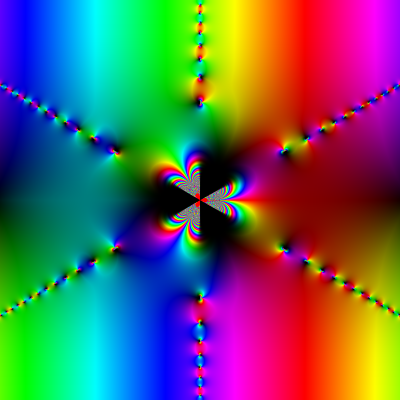

# Complex Graphs

This program generates graphs of complex functions such as the example below.



_`exp(csch(z*z*z))*sin(z)` on the region bounded by `-3 - 3i` to `3 + 3i`_

## Statements

### Numbers

All numbers are double precision real numbers. They may start with a digit or a decimal.

Examples include
* `0`
* `.1`
* `10`
* `10.1`

### Known Constants

There are three known constants they are

* `e` - the base of the natural log
* `i` - the imaginary unit
* `pi` - π

### Variables

Variables are unknowns which can evaluated as any double precision complex number. They must start with either an uppercase letter (`ABCDEFGHIJKLMNOPQRSTUVWXYZ`) or a lowercase letter (`abcdefghijklmnopqrstuvwxyz`) but otherwise may contain any number of letters or numbers. They may not match any known symbol such as a known constant, unary function, or binary function.

Examples include
* `x`
* `w2`
* `D`
* `Zug8Zug`

### Operators

Six operators are supported. The four standard infix arithmetic operators
* `+` - addition
* `-` - subtraction
* `*` - multiplication
* `/` - division

One unary prefix operator
* `-` - negation

Multiplication is also implied between symbols and substatements. For example `3i` is interpreted as `3 * i`.

### Unary Functions

Unary functions take a single parameter wrapped in parentheses. For example, `abs(x)`.

#### Manipulation Functions
* `abs` - the magnitude of the complex number
* `arg` - the phase angle of the complex number
* `ceil` - the ceiling of the real and imaginary parts of the complex number
* `conj` - the conjugate of the complex number
* `floor` - the floor of the real and imaginary parts of the complex number
* `frac` - the fractional part of the real and imaginary parts of the complex number
* `imag` - the imaginary part of the complex number
* `nint` - the nearest integer of the real and imaginary parts of the complex number
* `norm` - the normal of the complex number
* `real` - the real part of the complex number
* `sqrt` - the square root of the complex number

#### Exponential Functions
* `exp` - the complex base-e expoential of the complex number
* `lg` - the logarithm base-2 of the complex number
* `ln` - the natural logarithm of the complex number
* `log10` - the logarithm base-10 of the complex number

#### Trigonometric Functions
* `arccos` - the complex arc cosine of the complex number
* `arccot` - the complex arc cotangent of the complex number
* `arccsc` - the complex arc cosecant of the complex number
* `arcsec` - the complex arc secant of the complex number
* `arcsin` - the complex arc sine of the complex number
* `arctan` - the complex arc tangent of the complex number
* `cos` - the complex cosine of the complex number
* `cot` - the complex cotangent of the complex number
* `csc` - the complex cosecant of the complex number
* `sec` - the complex secant of the complex number
* `sin` - the complex sine of the complex number
* `tan` - the complex tangent of the complex number

#### Hyperbolic Functions
* `arccosh` - the complex arc hyperbolic cosine of the complex number
* `arccoth` - the complex arc hyperbolic cotangent of the complex number
* `arccsch` - the complex arc hyperbolic cosecant of the complex number
* `arcsech` - the complex arc hyperbolic secant of the complex number
* `arcsinh` - the complex arc hyperbolic sine of the complex number
* `arctanh` - the complex arc hyperbolic tangent of the complex number
* `cosh` - the complex hyperbolic cosine of the complex number
* `coth` - the complex hyperbolic cotangent of the complex number
* `csch` - the complex hyperbolic cosecant of the complex number
* `sech` - the complex hyperbolic secant of the complex number
* `sinh` - the complex hyperbolic sine of the complex number
* `tanh` - the complex hyperbolic tangent of the complex number

### Binary Functions

Binary functions take a two parameters separated by a comma and wrapped in parentheses. For example, `pow(2, 3)`.

* `log(b, z)` - the complex log base-`b` of the complex number `z`
* `pow(x, y)` - the complex power function `x`<sup>`y`</sup>

## Command Line

```
complex-graph [-c mode] -d domain -w width -h height -f function path
  c:     The contour mode; one of
           none, phase, magnitude, or both
           Defaults to none
  d:     The domain of the function formatted as the top left and
           bottom right corners of the domain separated by a semicolon
           For example: -5 + 5i;5 -5i
           Supports the same expression syntax as -f
  w:     The width of the image in pixels
  h:     The height of the image in pixels
  f:     The function to graph in the variable z
  path:  The path to the output file
```

## API

The primary object the API works with is `struct expression`, an opaque type that represents a parsed expression. These are allocated using `make_expression` and freed with `free_expression`.

Expressions are evaluated using `evaluate_expression`. All variables must have an assigned value when evaulating an expression. Variable values are defined using an array of `struct variable_value` with the `MAKE_VARIABLE_VALUE` macro used as a helper.

For example
```
struct variable_value variables[] = {
  MAKE_VARIABLE_VALUE("x", 3 + I),
};

struct expression *ex;
struct parse_result pr = make_expression("2x - 5", &ex);
if (pr.type != PARSE_RESULT_SUCCESS) {
  ...
}

double _Complex result;
struct eval_result er = evaluate_expression(ex, variables, 1, &result);
if (er.type != EVAL_ERROR_SUCCESS) {
  ...
}

free_expression(ex);
```

## Development

To set up the build system run `./scripts/configure-build.sh`.

To build a debug executable run `./scripts/build-debug.sh`. This builds both the program, `complex-graph` and its tests `complex-graph-test` and puts them into `./build/debug`.

To build a release executable run `./scripts/build-release.sh`. This builds both the program, `complex-graph` and its tests `complex-graph-test` and puts them into `./build/release`.

Run `complex-graph-test` to validate tests pass.

### Visual Studio Code

This project includes a development container with the packages necessary for building and debugging the project. It is recommended that the  extension be installed into the remote container.
